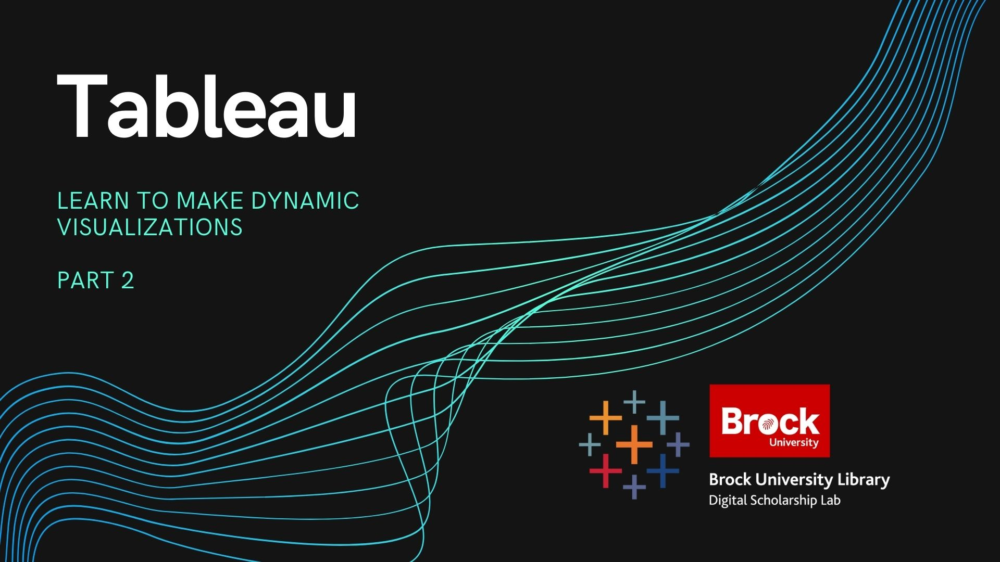

# Introduction to Tableau Part 2
Description of workshop including what you will learn and any tools that will be used in the process

----

## Setup Instructions
In preparation for this workshop, you will need to download and install the latest version of Tableau Public which can be done using the link below (keep in mind that you may need to contact your institution for permission to install programs).
  
[Download Tableau Public](https://public.tableau.com/s/download/public/pc64)

You will also need to download the two excel workbooks used in this workshop by using the links below:

[Dataset 1 - Mahogany Mary Sales Data](https://github.com/BrockDSL/Introduction-To-Tableau-Part-1/raw/master/Workshop%20Datasets/Mahogany%20Mary%202018%20Sales%20Data.xlsx)  
  
[Dataset 2 - Customer Satisfaction Data](https://github.com/BrockDSL/Introduction-To-Tableau-Part-1/raw/master/Workshop%20Datasets/Customer%20Satisfaction%20Mahogany%20Mary%202018.xlsx)

The last thing you will need for this workshop is a Tableau Public account.  You can sign up for one at [public.tableau.com](https://public.tableau.com/s/)

----

## Workshop Tasks
**Task Set 1**
1. Open Tableau Public and load in the Mahoganny Mary Sales Data then use the “add” button to add in the Satisfaction dataset.
2. Adjust the data types for both datasets so that currency values are all Number(decimal), Order Date is set to Date, and Order Number is set to string.
3. Go to sheet one and make a visualization of your choice by either dragging dimensions and measures onto the sheet or using one of the other methods learned in the first workshop.
4. Once you have finished, type “VIZ COMPLETED!!!” into the chat.

**Task Set 2**

1. Name your first sheet “My Viz”
2. Make 3 new sheets and name them “Raw Sale Total”, “No Tax Sale Total”, and “True Total”
3. On the “Raw Sale Total” sheet make a bar chart showing Sale Total by Product and add a visible Country filter
4. Make a calculated field called “No Tax Sale Total” that removes your local tax rate from the values.  (Sales Tax in Ontario Canada is 13%)
5. On the “No Tax Sale Total” sheet make the same visualization as the previous sheet except use No Tax Sale Total instead of Sale Total
6. Make a calculated field called “True Total” by adding No Tax Sale Total to Tip
7. On the “True Total” sheet make the same visualization again except using True Total
8. Once you are done type “CALCULATIONS COMPLETE” into the chat

**Task Set 3**
1. Make a new dashboard and name it
2. Add the three worksheets made in the last task to the dashboard (Floating or tiled is up to you)
3. Remove extra filters to tidy up and set filters to affect all worksheets
4. Add some aesthetic elements of your choice (Title, Explanation text, webpage box)
5. Once completed type “DASHBOARD MASTERED!!!” into the chat

**Task Set 4**

1. Make new story that contains at least one dashboard and one worksheet
2. When done type “ULTIMATE STORYTELLER!!!” in the chat

**Task Set 5**
1. Save your story to Tableau Public
2. Go to Tableau Public online and get the share link for your story
3. If you are comfortable doing so, post the share link in the chat and then type “BEHOLD!!!” in the chat

----

**This workshop is brought to you by the Brock University Digital Scholarship Lab.  For a listing of our upcoming workshops go to [Experience BU](https://experiencebu.brocku.ca/organization/dsl) if you are a Brock affiliate or [Eventbrite page](https://www.eventbrite.ca/o/brock-university-digital-scholarship-lab-21661627350) for external attendees.  For additional inquiries, contact [DSL@Brocku.ca](mailto:DSL@Brocku.ca)**

